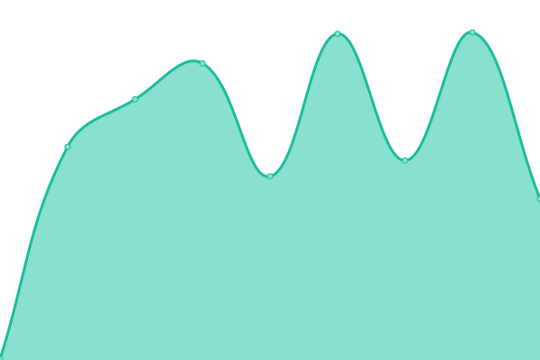

# [📈 Live Status](https://allinwebservice.github.io/status): <!--live status--> **🟧 Partial outage**

This repository contains the open-source uptime monitor and status page for [allinwebservice](https://allinwebservice.github.io/status), powered by [Upptime](https://github.com/upptime/upptime).

With [Upptime](https://upptime.js.org), you can get your own unlimited and free uptime monitor and status page, powered entirely by a GitHub repository. We use [Issues](https://github.com/allinwebservice/status/issues) as incident reports, [Actions](https://github.com/allinwebservice/status/actions) as uptime monitors, and [Pages](https://allinwebservice.github.io/status) for the status page.

<!--start: status pages-->
<!-- This summary is generated by Upptime (https://github.com/upptime/upptime) -->
<!-- Do not edit this manually, your changes will be overwritten -->
<!-- prettier-ignore -->
| URL | Status | History | Response Time | Uptime |
| --- | ------ | ------- | ------------- | ------ |
|  [Apliso](https://apliso.net) | 🟩 Up | [apliso.yml](https://github.com/allinwebservice/status/commits/HEAD/history/apliso.yml) | 

 1055ms
     
 | 

<a href="https://allinwebservice.github.io/status/history/apliso">100.00%</a>
    

|  [ČSUZ](https://csuz.cz) | 🟥 Down | [csuz.yml](https://github.com/allinwebservice/status/commits/HEAD/history/csuz.yml) | 

 460ms
     
 | 

<a href="https://allinwebservice.github.io/status/history/csuz">100.00%</a>
    

|  [CNSC](https://cnsc.cz) | 🟩 Up | [cnsc.yml](https://github.com/allinwebservice/status/commits/HEAD/history/cnsc.yml) | 

 531ms
     
 | 

<a href="https://allinwebservice.github.io/status/history/cnsc">100.00%</a>
    

|  [Infosafe](https://infosafe.tech) | 🟩 Up | [infosafe.yml](https://github.com/allinwebservice/status/commits/HEAD/history/infosafe.yml) | 

 1014ms
     
 | 

<a href="https://allinwebservice.github.io/status/history/infosafe">100.00%</a>
    

|  [All In Web Service](https://www.allinweb.cz/) | 🟩 Up | [all-in-web-service.yml](https://github.com/allinwebservice/status/commits/HEAD/history/all-in-web-service.yml) | 

 250ms
     
 | 

<a href="https://allinwebservice.github.io/status/history/all-in-web-service">100.00%</a>
    

|  [111 Malíři](https://www.111maliri.cz/) | 🟩 Up | [111-maliri.yml](https://github.com/allinwebservice/status/commits/HEAD/history/111-maliri.yml) | 

 283ms
     
 | 

<a href="https://allinwebservice.github.io/status/history/111-maliri">100.00%</a>
    

|  [Solis nakladatelství](https://www.solis-nakladatelstvi.cz/) | 🟩 Up | [solis-nakladatelstvi.yml](https://github.com/allinwebservice/status/commits/HEAD/history/solis-nakladatelstvi.yml) | 

 252ms
     
 | 

<a href="https://allinwebservice.github.io/status/history/solis-nakladatelstvi">100.00%</a>
    

|  [Jantač Capital](https://www.jantac-capital.cz/) | 🟩 Up | [jantac-capital.yml](https://github.com/allinwebservice/status/commits/HEAD/history/jantac-capital.yml) | 

 230ms
     
 | 

<a href="https://allinwebservice.github.io/status/history/jantac-capital">100.00%</a>
    

|  [Chlebík Advokáti](https://www.chlebikadvokati.cz/) | 🟩 Up | [chlebik-advokati.yml](https://github.com/allinwebservice/status/commits/HEAD/history/chlebik-advokati.yml) | 

 248ms
     
 | 

<a href="https://allinwebservice.github.io/status/history/chlebik-advokati">100.00%</a>
    

|  [Fit Slim](https://www.fit-slim.cz/) | 🟩 Up | [fit-slim.yml](https://github.com/allinwebservice/status/commits/HEAD/history/fit-slim.yml) | 

 235ms
     
 | 

<a href="https://allinwebservice.github.io/status/history/fit-slim">100.00%</a>
    

|  [Carboneo](https://www.carboneo.cz/) | 🟩 Up | [carboneo.yml](https://github.com/allinwebservice/status/commits/HEAD/history/carboneo.yml) | 

 463ms
     
 | 

<a href="https://allinwebservice.github.io/status/history/carboneo">100.00%</a>
    

|  [Mine Coin](https://www.mine-coin.cz/) | 🟩 Up | [mine-coin.yml](https://github.com/allinwebservice/status/commits/HEAD/history/mine-coin.yml) | 

 333ms
     
 | 

<a href="https://allinwebservice.github.io/status/history/mine-coin">100.00%</a>
    

|  [Barber MNB](https://www.barber-mnb.cz/) | 🟩 Up | [barber-mnb.yml](https://github.com/allinwebservice/status/commits/HEAD/history/barber-mnb.yml) | 

 393ms
     
 | 

<a href="https://allinwebservice.github.io/status/history/barber-mnb">100.00%</a>
    

|  [Bohemia Shield](https://www.bohemiashield.cz/) | 🟩 Up | [bohemia-shield.yml](https://github.com/allinwebservice/status/commits/HEAD/history/bohemia-shield.yml) | 

 265ms
     
 | 

<a href="https://allinwebservice.github.io/status/history/bohemia-shield">100.00%</a>
    

|  [Premiq Benefit](https://www.premiq-benefit.cz/) | 🟩 Up | [premiq-benefit.yml](https://github.com/allinwebservice/status/commits/HEAD/history/premiq-benefit.yml) | 

 247ms
     
 | 

<a href="https://allinwebservice.github.io/status/history/premiq-benefit">100.00%</a>
    

|  [Ovocný strom](https://www.ovocny-strom.cz/) | 🟩 Up | [ovocny-strom.yml](https://github.com/allinwebservice/status/commits/HEAD/history/ovocny-strom.yml) | 

 253ms
     
 | 

<a href="https://allinwebservice.github.io/status/history/ovocny-strom">100.00%</a>
    

|  [Profesionální foto](https://www.profesionalnifoto.cz/) | 🟩 Up | [profesionalni-foto.yml](https://github.com/allinwebservice/status/commits/HEAD/history/profesionalni-foto.yml) | 

 287ms
     
 | 

<a href="https://allinwebservice.github.io/status/history/profesionalni-foto">100.00%</a>
    

|  [Stavza](https://www.stavza.cz/) | 🟩 Up | [stavza.yml](https://github.com/allinwebservice/status/commits/HEAD/history/stavza.yml) | 

 209ms
     
 | 

<a href="https://allinwebservice.github.io/status/history/stavza">100.00%</a>
    

|  [Czech-Bulgarian Chamber](https://www.chamber-bg.cz/) | 🟩 Up | [czech-bulgarian-chamber.yml](https://github.com/allinwebservice/status/commits/HEAD/history/czech-bulgarian-chamber.yml) | 

 552ms
     
 | 

<a href="https://allinwebservice.github.io/status/history/czech-bulgarian-chamber">100.00%</a>
    

|  [C-T Elektromontáže](https://www.c-t-elektromontaze.cz/) | 🟩 Up | [c-t-elektromontaze.yml](https://github.com/allinwebservice/status/commits/HEAD/history/c-t-elektromontaze.yml) | 

 231ms
     
 | 

<a href="https://allinwebservice.github.io/status/history/c-t-elektromontaze">100.00%</a>
    

<!--end: status pages-->

[**Visit our status website →**](https://allinwebservice.github.io/status)

## 📄 License

- Powered by: [Upptime](https://github.com/upptime/upptime)
- Code: [MIT](./LICENSE) © [Anand Chowdhary](https://anandchowdhary.com), supported by [Pabio](https://pabio.com)
- Data in the `./history` directory: [Open Database License](https://opendatacommons.org/licenses/odbl/1-0/)
